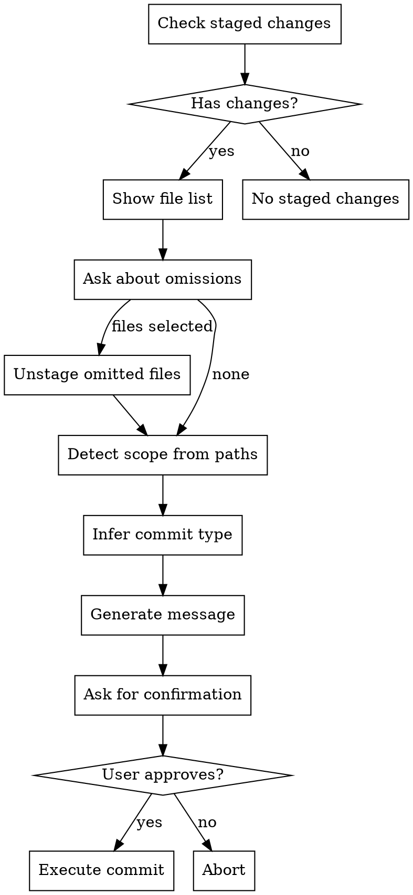

# Standard Commit

Generate conventional commit messages with auto-detected scope and file omission support.

## Workflow



## Step 1: Check Staged Changes

Run these commands to understand current state:
```bash
git status
git diff --cached --stat
git diff --cached --name-only
```

If no staged changes, inform the user and stop.

## Step 2: File Omission

Show the user the list of staged files and ask:

**Use AskUserQuestion** with multiSelect: true to let user pick files to exclude. Options should list each staged file.

If user selects files to omit, unstage them:
```bash
git reset HEAD <file1> <file2> ...
```

## Step 3: Detect Scope

Analyze remaining staged file paths to determine scope:

| Path Pattern | Scope |
|--------------|-------|
| `src/auth/*`, `lib/auth/*` | auth |
| `src/components/*`, `components/*` | components |
| `src/api/*`, `api/*` | api |
| `src/utils/*`, `lib/*`, `utils/*` | utils |
| `tests/*`, `test/*`, `__tests__/*`, `*.test.*`, `*.spec.*` | test |
| `docs/*`, `*.md` (not test) | docs |
| `src/hooks/*`, `hooks/*` | hooks |
| `src/services/*`, `services/*` | services |
| `src/store/*`, `store/*`, `src/state/*` | state |
| `src/styles/*`, `styles/*`, `*.css`, `*.scss` | styles |
| `config/*`, `*.config.*` | config |
| `.github/*`, `.gitlab-ci.*` | ci |
| `Dockerfile`, `docker-compose.*` | docker |

**Scope inference rules:**
1. Extract the most specific meaningful directory from each file path
2. Count occurrences of each potential scope
3. Use the most common scope
4. If files span 3+ unrelated scopes, omit scope entirely
5. Root-level config files: use `config` scope

## Step 4: Infer Commit Type

| Type | When to Use |
|------|-------------|
| `feat` | New functionality, new files (not tests) |
| `fix` | Bug fixes, error corrections |
| `docs` | Documentation only (README, comments, JSDoc) |
| `style` | Formatting, whitespace, semicolons (no logic change) |
| `refactor` | Code restructuring without behavior change |
| `perf` | Performance improvements |
| `test` | Adding or updating tests |
| `build` | Build system, dependencies (package.json, webpack) |
| `ci` | CI/CD configuration |
| `chore` | Maintenance, tooling, other non-src changes |

**Type inference hints:**
- New files in src/ → `feat`
- Only test files changed → `test`
- Only .md files → `docs`
- package.json, lock files → `build`
- Deleted files only → `refactor` or `chore`
- Look for "fix", "bug", "issue" in diff content → `fix`

## Step 5: Generate Commit Message

**Format:**
```
<type>(<scope>): <description>

[optional body]
```

**Rules:**
- Subject line: max 72 characters
- Description: imperative mood ("add feature" not "added feature")
- Body: only if 3+ files changed or 50+ lines modified
- Body should explain WHY, not WHAT (the diff shows what)

## Step 6: Confirm Before Committing

**IMPORTANT: Always ask for user confirmation before executing the commit.**

Display the generated commit message in a code block, then use **AskUserQuestion** to confirm:

Question: "Commit with this message?"
Options:
- "Yes, commit" - Execute the commit
- "Edit message" - Let user provide a different message
- "Abort" - Cancel the commit

If user selects "Edit message", ask them to provide the new message and use that instead.

Only proceed to execute the commit after explicit user approval.

## Step 7: Execute Commit

**Use HEREDOC for commit:**
```bash
git commit -m "$(cat <<'EOF'
<type>(<scope>): <description>

[body if needed]
EOF
)"
```

## Example

Staged files:
```
src/auth/login.ts
src/auth/session.ts
tests/auth/login.test.ts
```

Analysis:
- Scope: `auth` (3/3 files in auth-related paths)
- Type: `feat` (new functionality with tests)

Generated message:
```
feat(auth): add login flow with session management
```

## Current State

- **Branch**: !`git branch --show-current`
- **Staged files**: !`git diff --cached --name-only`
- **Staged diff stats**: !`git diff --cached --stat`

## Staged Diff

!`git diff --cached`
